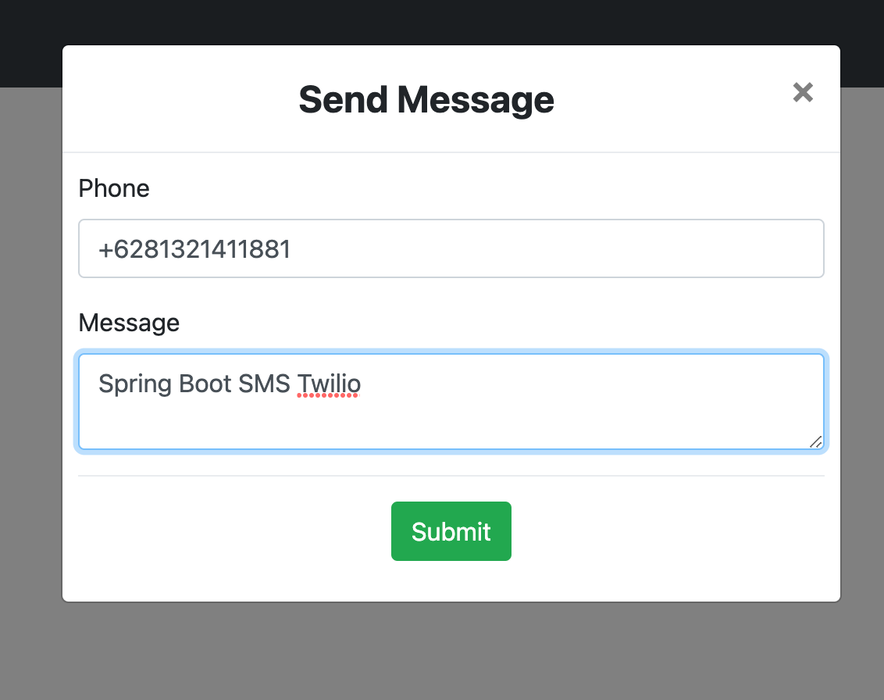

# spring-boot-twilio-sms-demo2

### Things todo list

1. Clone this repository: `git clone https://github.com/hendisantika/spring-boot-twilio-sms-demo2.git`
2. Navigate to the folder: `cd spring-boot-twilio-sms-demo2`
3. Replace Twilio Account with your own credentials on application.yml
4. Run the application: `mvn clean spring-boot:run`
5. Open your favorite browser: http://localhost:8080

### Image Screen shot

SMS Page

